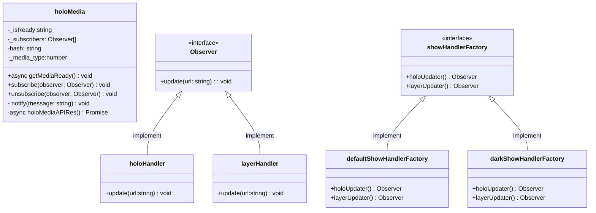
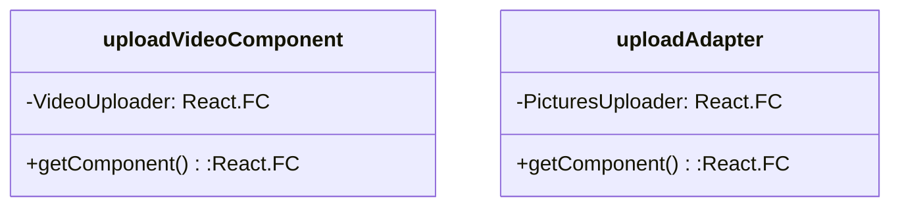

---

---
/holo
ホログラムをスマホで作ってみよう……のフロント側。

holoMediaと(holo|layer)HandlerはObserver patternで実装している。  
mediaを取ってくる処理が終わったらholoHandler,layerHandlerに通知され、処理が動く。
reactではuseStateがあるので正直不要というか使わないほうが良いのでは……

showHandlerFactoryと(dark|default)ShowHandlerFactoryはabstract factory patternを想定している。showhandlerを作る際に、layerとholoをそれぞれ作って使うのでfactory内で一括でやらせている。

Uploadcomponents。adopter patternのために書いた今回の魔境。動画のみだったところ(uploadVideoComponent)に写真も追加する仕様が降ってきた(uploadAdapter)想定で書いたが、この規模や状態だと書き直すか、適当なラッパーで吸収したほうが一億倍安定・早い・楽。練習にしてもapi側とかのほうが良かった。

---

memo

sudo apt update  
curl -sL https://deb.nodesource.com/setup_16.x | sudo -E bash -  
sudo apt install nodejs -y  
npm install -g create-react-app  
npm install dotenv  
myenv上のmy-app下で nohup npm run dev -- -H 0.0.0.0 -p 4000 > react.log 2>&1 &  
~~nginx-reactを同ディレクトリでdocker-compose up --build -d   
これ用のconfで立ち上がる~~→localでは使わない、prodでも使わない。

バックエンドはfastapi(pandas)->githubのsnippet  
と、NestJS->githubのnestjs

使っているのは
react:vercel
fastapi/NestJS:render
postgress:supabase
keepalive:UptimeRobot

---
