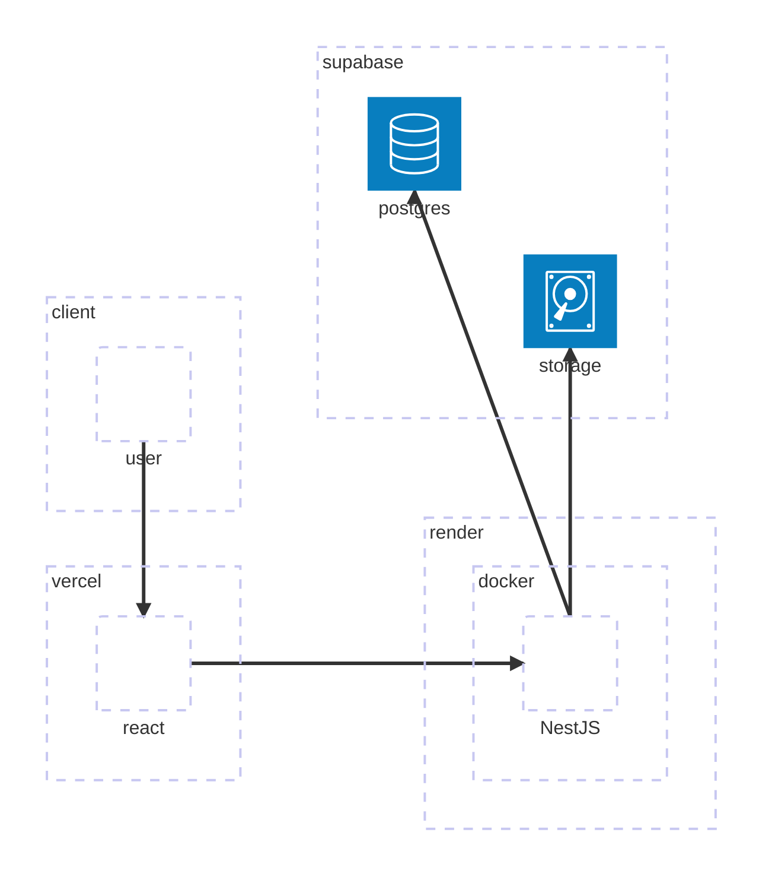
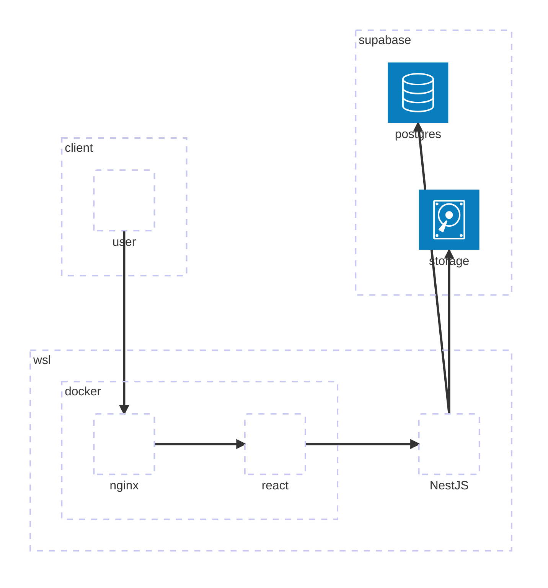
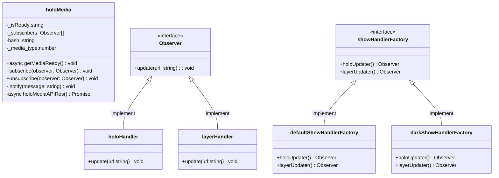
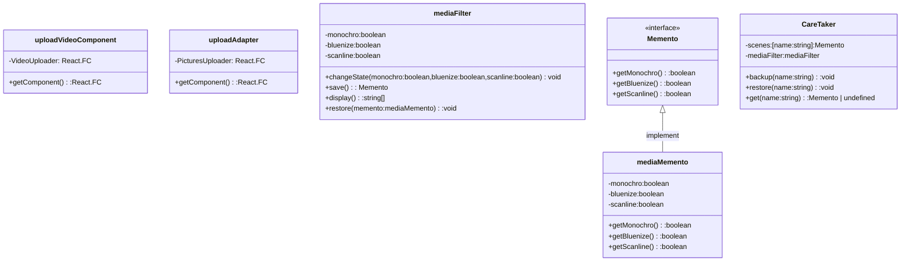

# Hologram Media Generator

スマホでホログラム動画/写真を作るためのWebアプリ。LLM不使用(デバッグは頼った)の温かみのある手書きコードです。デザインパターン学習用に無理に各パターンを詰め込んであります。

- 画像 / 動画アップロード
- ホログラム表示(filter)

---
## Design Pattern Usage
|pattern|purpose|file|
|---|---|---|
|Memento|表示のカスタム機能|https://github.com/shu-hi/react/blob/main/my-app/src/app/holo/fileComponents.tsx
|Strategy|ダークモード実装時の拡張用|https://github.com/shu-hi/nest-back/blob/main/my-app/src/services/holoClass.ts
|Command||統合作業中
|Composite|動画と写真をmediaとしてまとめて扱う|https://github.com/shu-hi/nest-back/blob/main/my-app/src/services/holoClass.ts
|Abstract Factory|写真/動画で使う材料(クラス)をまとめて生成|https://github.com/shu-hi/react/blob/main/my-app/src/app/holo/showHolo.ts
|Observer|apiから取れたら通知して描画する|https://github.com/shu-hi/react/blob/main/my-app/src/app/holo/showHolo.ts
|Proxy|いろいろ。|開発ではnginx使ってたりもする。
|Simple Factory|写真と動画の分岐を隠蔽してクラス作成|https://github.com/shu-hi/nest-back/blob/main/my-app/src/services/holoClass.ts
|Bridge|汚い型を委譲できれいに|https://github.com/shu-hi/react/blob/main/my-app/src/app/holo/UploadComponents.tsx
|Adapter|動画のinterfaceに写真/動画両方の機能を付けるadapter|https://github.com/shu-hi/react/blob/main/my-app/src/app/holo/UploadComponents.tsx

---
## 本番

## 開発

---

---

---
/holo
ホログラムをスマホで作ってみよう……のフロント側。

holoMediaと(holo|layer)HandlerはObserver patternで実装している。  
mediaを取ってくる処理が終わったらholoHandler,layerHandlerに通知され、処理が動く。
reactではuseStateがあるので正直不要というか使わないほうが良いのでは……

showHandlerFactoryと(dark|default)ShowHandlerFactoryはabstract factory patternを想定している。showhandlerを作る際に、layerとholoをそれぞれ作って使うのでfactory内で一括でやらせている。

Uploadcomponents。adopter patternのために書いた今回の魔境。動画のみだったところ(uploadVideoComponent)に写真も追加する仕様が降ってきた(uploadAdapter)想定で書いたが、この規模や状態だと書き直すか、適当なラッパーで吸収したほうが一億倍安定・早い・楽。練習にしてもapi側とかのほうが良かった。型について一部delegation patternのようなものを実装している。

filterComponents。表示のカスタムと保存のためにmemento　patternを採用した。
reactのrenderのタイミングのため、素直な実装ではなくrefを通している。これもreactだと使わなくていいパターンな気がする。

---

memo

sudo apt update  
curl -sL https://deb.nodesource.com/setup_16.x | sudo -E bash -  
sudo apt install nodejs -y  
npm install -g create-react-app  
npm install dotenv  
myenv上のmy-app下で nohup npm run dev -- -H 0.0.0.0 -p 4000 > react.log 2>&1 &  
~~nginx-reactを同ディレクトリでdocker-compose up --build -d   
これ用のconfで立ち上がる~~→localでは使わない、prodでも使わない。

バックエンドはfastapi(pandas)->githubのsnippet  
と、NestJS->githubのnestjs

使っているのは
react:vercel
fastapi/NestJS:render
postgres:supabase
keepalive:UptimeRobot

---
